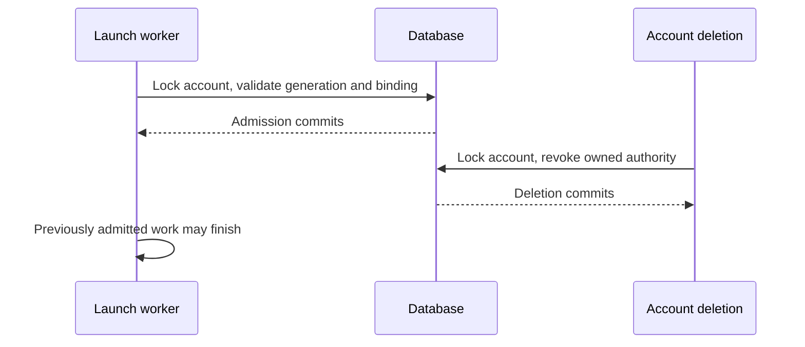

# Account deletion and authority revocation

After deletion succeeds, no new authentication, credentials, ownership, or
launch authorization can be granted to that account identity. Work admitted
before revocation may finish. Deletion is a database commit boundary; it does
not promise to kill an already running process or undo an external operation.

## Identity and saved authority

The username is a reusable display/login name. A random account generation
identifies one registration. Deletion retains a users-table tombstone, clears
its password and admin flag, and hides it from account/permission lookups.
Re-registration assigns a fresh generation.

Accounts JWTs carry that generation. Every authentication reads the account's
current generation and deletion status, including on other replicas; accounts
identity caching cannot extend access. Device and refresh grants, magic links,
scheduled tasks, and hosts retain their owner's generation. An explicitly saved
null generation means an external identity; it cannot acquire a subsequently
registered account's authority.

Authenticated requests capture account authority in a workspace-scoped
ContextVar. Async tasks and `asyncio.to_thread` inherit it. Durable scheduled
work restores its saved generation. Context changes made inside a worker do not
flow back to its caller: runner token issuance resolves the persisted host and
session ownership, revalidates them, and mints within the same scoped worker
and transaction.

OIDC/header identities and scoped machine-principal tokens retain their own
lifecycle. The single-user local identity continues to work without an accounts
registration.

## Transaction ordering

Authority writers lock account rows before grants, hosts, or other resources.
Actor and target accounts are locked in username order. Account deletion locks
the full administrator/actor/target set in that order before enforcing the
last-admin invariant. PostgreSQL uses locking reads; SQLite uses immediate
write transactions. Captured generations are checked under those locks, so a
request authenticated earlier cannot write authority into a replacement account.

Deletion removes session permissions, saved provider connections, projects,
project ordering, and outstanding invitations/magic links created for or by the
user. It disables scheduled tasks and revokes device/refresh grants. Session
history remains, with project/host bindings detached where required. A reused
username does not inherit those permissions, credentials, or projects.

Account deletion and ordinary host deletion share one host-cleanup operation.
Host rows are locked before cleanup, preventing a concurrent dormant-sandbox
replacement from escaping between bulk statements. Launch credentials are
cleared. Managed-host tombstones preserve pending sandbox IDs until the existing
provider cleanup worker confirms termination. Provider destruction happens
outside the account transaction; failures leave cleanup retriable.

## Launch admission

All host launches pass a final database admission check immediately before
runner binding and launch-frame dispatch. It locks the account, checks the
connection's saved generation, then validates the live host and session-host
binding. A scheduled task's earlier host resolution is not launch admission.



If deletion commits first, admission fails and no launch frame is queued. If
admission commits first, dispatch may complete afterward. This makes the race
well-defined without holding a database transaction across a network operation.
A running runner must still obtain fresh authority for new owner credentials;
its binding token cannot mint for a deleted or re-registered identity.

## Migration and deployment

The migration assigns generations to existing password-bearing users and
backfills their saved authority. Valid refresh grants retain their secrets and
can renew into generation-bearing JWTs. Existing ordinary cookies/JWTs lack the
claim and require login again. Existing OAuth connection handshakes should be
restarted after upgrade.

Accounts-mode deployments require a coordinated stop/upgrade/start of every
server and scheduler sharing the database. Mixed old/new versions are unsafe:
old code ignores tombstones and generations. Back up the database, stop all
writers, upgrade/migrate, and restart only the new version. Do not roll back to
old code against the new schema. Downgrade removes account tombstones so old code
cannot interpret them as active passwordless users; it does not undo external
cleanup or restore removed authority.

## Verification

Run the revocation HTTP/store/migration tests and the real two-server startup
check from the candidate checkout:

```sh
uv run --no-sync pytest tests/server/test_account_revocation.py tests/stores/test_account_revocation.py tests/db/test_migration_account_revocation.py tests/server/integration/test_account_revocation_processes.py -q
```

Run the store suite against PostgreSQL using `OMNIGENT_TEST_DB_URI` as well.
The launch tests use real orchestration, stores, and outbound frames with a
simulated host response. They do not start a runner process or an external
sandbox. The two-server test launches actual CLI subprocesses and sends HTTP
requests against shared SQLite. Neither test calls an LLM/provider or establishes
production rollout readiness.

For a human check on an isolated accounts deployment: log in as a non-admin in
one browser profile and as admin in another; delete the non-admin; verify the
first profile's next protected request requires login. Register that username
again and verify the original cookie still fails, the replacement account can
log in, and its saved connections, projects, and session ownership are empty.
